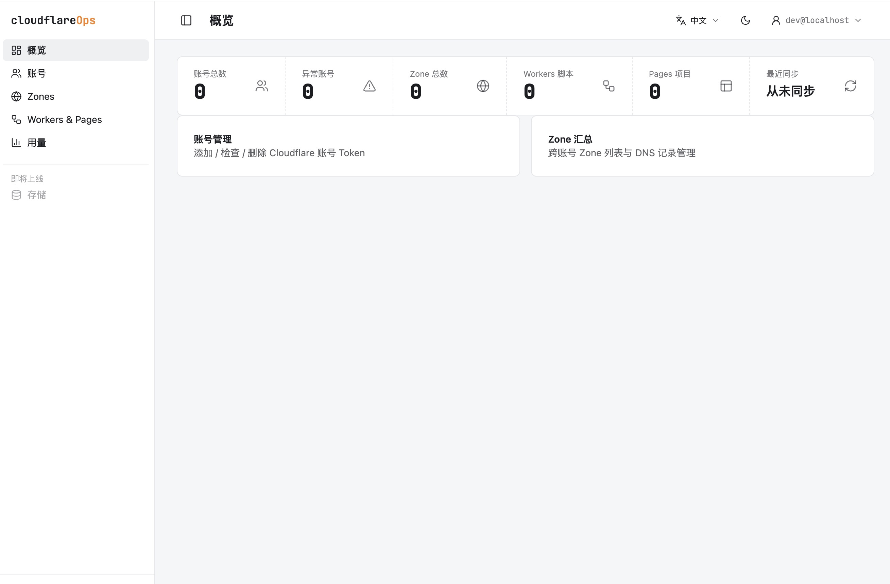
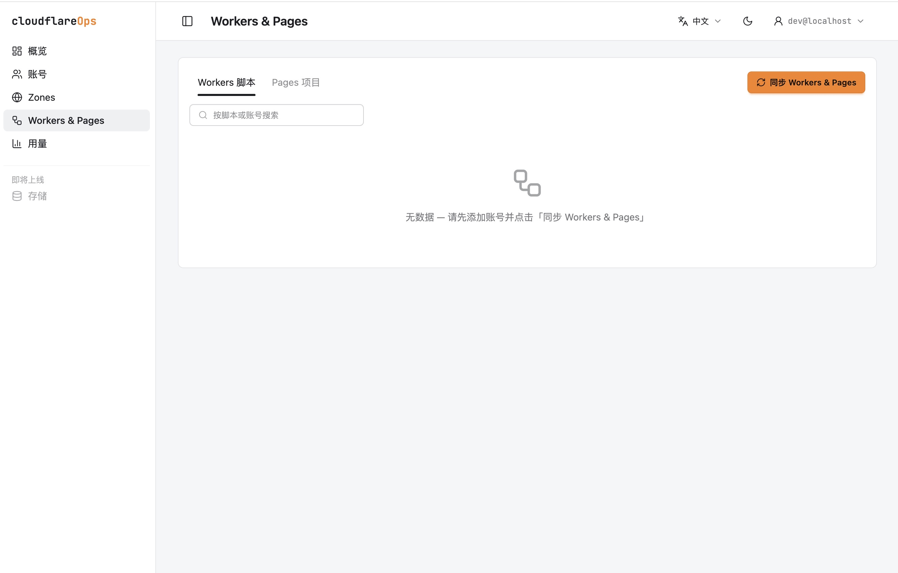
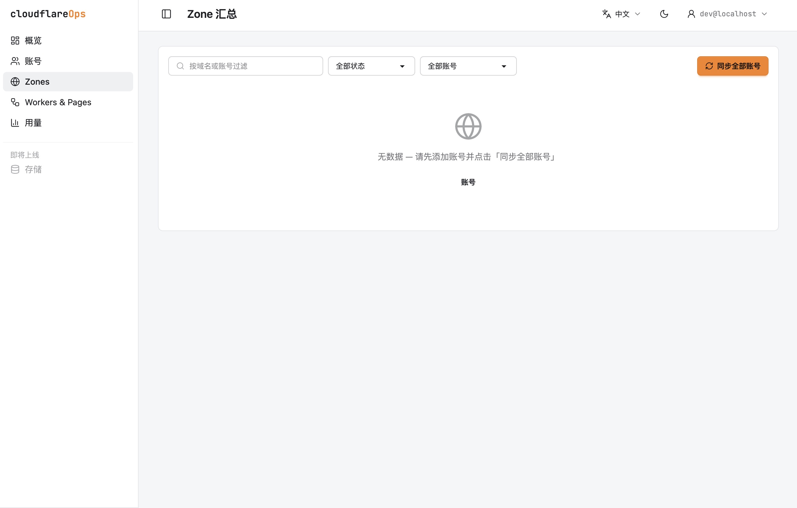
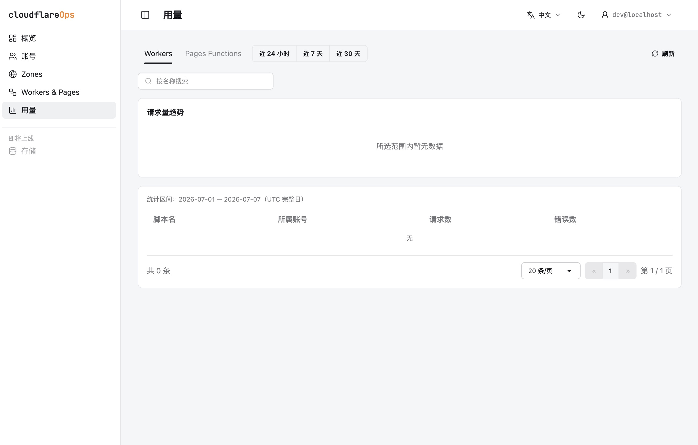

# cloudflareOps

**English** | [简体中文](./README.zh-CN.md) | [FAQ](./FAQ.md)

A self-hosted dashboard for managing **multiple Cloudflare accounts** from one place. Aggregate Zones, DNS, Workers, Pages, R2 storage, and usage analytics across every account you own, behind Cloudflare Access authentication.

Built with Astro 5 + React + DaisyUI, deployed on Cloudflare Pages + D1. The UI is bilingual (English / 简体中文) with a language switcher in the header — the choice is remembered via cookie and defaults to the browser language.

## Features

- **Multi-account aggregation** — add API tokens for any number of Cloudflare accounts, verify token health, search/paginate accounts, and manage everything from a single dashboard. Tokens are encrypted at rest and de-duplicated per user.
- **Dashboard overview** — quickly see account health, cached Zone totals, Workers scripts, Pages projects, and last sync status.
- **Zones & DNS management** — sync Zones across all accounts, filter by domain/status/account, inspect Zone metadata, and create/update/delete DNS records through the Cloudflare API.
- **Workers management** — list scripts across accounts, inspect bindings/settings/history/deployments, view and edit single-module source, manage cron triggers, secrets, workers.dev URLs, and custom domains when the token has edit scope.
- **Pages management** — browse Pages projects, inspect deployments/logs/domains, trigger deployments, retry/rollback deployments, purge build cache, and attach custom domains with optional DNS record creation.
- **R2 storage management** — sync buckets across accounts, create/delete buckets, and browse objects with folder navigation and pagination. Uploads and downloads go browser-direct through presigned S3 URLs (no server relay); downloads are forced as real attachments. Objects preview in-app — images, text/code, Markdown (sandboxed), PDF, video/audio — with text previews server-relayed under a 1 MB cap. Bucket settings cover public access (r2.dev and custom domains), CORS, and lifecycle rules, and each bucket has storage / Class A+B operations charts.
- **Usage analytics** — view Workers and Pages Functions invocation counts with 24h hourly snapshots, 7d/30d daily snapshots, searchable tables, account filters, and trend charts.
- **Email sending** — configure verified sending domains backed by either [Resend](https://resend.com/) (stored API key) or Cloudflare Email Sending (reuses an existing account token), then compose and send mail from the dashboard. Bodies support Markdown / HTML / plain text with a live preview, and every send is written to an auditable log (success or failure) you can review and re-render later.
- **Cloudflare Access login** — protect the dashboard with Cloudflare Access, verify the `Cf-Access-Jwt-Assertion` JWT on every request, and use the authenticated email as the per-user data boundary.
- **Per-user data isolation** — every user-owned query is scoped by authenticated email, so one Access user cannot see another user's accounts or caches.
- **Resilient sync model** — upstream Cloudflare data is cached in D1 using atomic per-account refreshes; one bad token is reported as an account failure without blocking other accounts.
- **Bilingual, mobile-friendly UI** — Simplified Chinese is the default locale, English routes are available under `/en`, and the main views are designed for narrow screens without page-level horizontal overflow.

## Screenshots

| Dashboard | Workers & Pages |
| --- | --- |
|  |  |

| Zones | Usage analytics |
| --- | --- |
|  |  |

## Tech Stack

- **Runtime & framework** — [Astro 5](https://astro.build/) SSR with the [Cloudflare adapter](https://docs.astro.build/en/guides/integrations-guide/cloudflare/) targeting Pages Functions / workerd.
- **Interactive UI** — [React 19](https://react.dev/) islands for feature panels, [Tailwind CSS 4](https://tailwindcss.com/) and [DaisyUI 5](https://daisyui.com/) for the design system, [lucide-react](https://lucide.dev/) icons, and [Recharts](https://recharts.org/) for usage charts.
- **Cloudflare platform** — [Cloudflare Pages](https://pages.cloudflare.com/) for hosting, [D1](https://developers.cloudflare.com/d1/) for SQLite-backed storage, and [Cloudflare Access](https://developers.cloudflare.com/cloudflare-one/policies/access/) for Zero Trust authentication.
- **Authentication pipeline** — Astro middleware verifies Access JWTs against the team JWKS, stores the authenticated email in `locals.userEmail`, supports a guarded `DEV_MODE` bypass for local development, and uses `/cdn-cgi/access/logout` for Access session logout.
- **Cloudflare integration** — official [`cloudflare`](https://github.com/cloudflare/cloudflare-typescript) SDK wrapped by a local `CfClient`, with REST and GraphQL fallbacks for endpoints not covered cleanly by the SDK.
- **Storage & security** — D1 cache tables mirror Cloudflare API resources; API tokens are encrypted with AES-GCM and matched by SHA-256 token hashes for duplicate detection.
- **Routing & localization** — Astro file-based routes, API routes under `src/pages/api`, and a small i18n layer for Chinese / English routing and strings.
- **Quality tooling** — [Vitest](https://vitest.dev/) unit tests, an in-memory `better-sqlite3` D1 test double that runs real migrations, `astro check` + TypeScript, and [Biome](https://biomejs.dev/) for linting/formatting.

## Prerequisites

- Node.js **>= 20.3.0**
- A Cloudflare account with Pages, D1, and Zero Trust (Access) available
- [Wrangler](https://developers.cloudflare.com/workers/wrangler/) (installed as a dev dependency)

## Local Development

> This project can run with npm or pnpm, but use only one package manager for a given `node_modules` install. The repository includes a `pnpm-lock.yaml`; pnpm is recommended for day-to-day local development.

1. Install dependencies:
   ```bash
   pnpm install
   ```
   If pnpm reports ignored build scripts, approve the native/runtime packages and rebuild them:
   ```bash
   pnpm approve-builds better-sqlite3 esbuild workerd sharp
   pnpm rebuild
   ```
   `better-sqlite3` is required by the local D1 test helper and dev D1 binding; `esbuild` / `workerd` / `sharp` are used by the Astro and Cloudflare toolchain. If you use npm instead, run `npm install` and do not mix the resulting install with pnpm in the same `node_modules`.
2. Create your Wrangler config (gitignored):
   ```bash
   cp wrangler.toml.example wrangler.toml
   ```
   The default `database_id` placeholder is fine for local D1; you only need a real id for remote deploys.
3. Copy the example env file and generate a random `ENCRYPTION_KEY`:
   ```bash
   cp .dev.vars.example .dev.vars
   node -e "console.log(require('crypto').randomBytes(32).toString('hex'))"
   ```
   Paste the generated value into `ENCRYPTION_KEY` in `.dev.vars`. Keep `DEV_MODE=true` and leave `CF_ACCESS_*` unset for local development.
4. Create the local D1 database and run migrations:
   ```bash
   pnpm run db:migrate
   ```
   Migration files live in `migrations/`; add new changes as `NNNN_description.sql`.
5. Start the dev server (Astro dev with HMR):
   ```bash
   pnpm run dev
   ```
   Runs on port 4321 with a live D1 binding (backed by `better-sqlite3`) and `.dev.vars` loaded. `DEV_MODE=true` bypasses Cloudflare Access for local development.

   To verify a production build locally instead, use `wrangler pages dev`:
   ```bash
   pnpm run build
   pnpm run preview
   ```

6. Before submitting changes, run the standard checks:
   ```bash
   pnpm run typecheck
   pnpm run test
   ```

See [FAQ](./FAQ.md) for common local setup issues, including `better_sqlite3.node` binding errors and Access-related 403s.

> **Note:** `DEV_MODE` bypass and Access config are mutually exclusive (a security guard rail). If both are set, the bypass is disabled and you'll get a local 403. Keep `CF_ACCESS_*` unset locally.

## Deployment

1. Create your `wrangler.toml` (it is gitignored because it holds your own database id):
   ```bash
   cp wrangler.toml.example wrangler.toml
   ```
   Then create the remote D1 database and paste the returned `database_id` into `wrangler.toml`:
   ```bash
   wrangler d1 create cloudflareops-db
   ```
   > Deploying via **Cloudflare Pages Git integration** instead of `npm run deploy`? The CI build won't see your gitignored `wrangler.toml` — configure the D1 binding in the Pages dashboard (**Settings → Functions → D1 database bindings**, binding name `DB`).
2. Apply migrations to the remote database:
   ```bash
   npm run db:migrate:remote
   ```
3. In the Cloudflare **Zero Trust** dashboard, create a self-hosted **Access** application pointing at your Pages domain. This gives you the two Access values the app needs:

   | Variable | Where to find it |
   | --- | --- |
   | `CF_ACCESS_TEAM_DOMAIN` | Your team domain, `<your-team>.cloudflareaccess.com`. Zero Trust → **Settings → Custom Pages** (or the URL you log in at). Value is the full host, e.g. `acme.cloudflareaccess.com` — no `https://`. |
   | `CF_ACCESS_AUD` | Zero Trust → **Access → Applications → (your app) → Overview**, field **Application Audience (AUD) Tag** — a long hex string. |

4. Set the three runtime variables on the **Pages project** (do *not* set `DEV_MODE` in production). Two ways:

   - **Dashboard:** Workers & Pages → your project → **Settings → Variables and Secrets** → add for the **Production** environment. Mark `ENCRYPTION_KEY` (and optionally `CF_ACCESS_AUD`) as **encrypted (Secret)**; `CF_ACCESS_TEAM_DOMAIN` is a public hostname and can be a plain variable.
   - **CLI:**
     ```bash
     npx wrangler pages secret put ENCRYPTION_KEY
     npx wrangler pages secret put CF_ACCESS_TEAM_DOMAIN
     npx wrangler pages secret put CF_ACCESS_AUD
     ```

   | Variable | Value |
   | --- | --- |
   | `ENCRYPTION_KEY` | The 64-hex-char key you generated for local dev (or a fresh one) |
   | `CF_ACCESS_TEAM_DOMAIN` | e.g. `acme.cloudflareaccess.com` |
   | `CF_ACCESS_AUD` | The AUD tag from step 3 |

   > **Important:** `CF_ACCESS_TEAM_DOMAIN` and `CF_ACCESS_AUD` are what gate the app. If either is missing in production the app returns **500 "Cloudflare Access not configured"**; if the request carries no valid Access JWT it returns **403**. Also make sure the Access application's domain matches your Pages domain, otherwise the JWT audience/issuer check fails.
5. Deploy:
   ```bash
   npm run deploy
   ```
   Re-deploy (or redeploy from the dashboard) after changing variables so the new values take effect.

## Account Token Requirements

Create an API Token for each Cloudflare account you want to manage. Minimum scopes:

- **Zones / DNS:** Zone → Zone: Read; Zone → DNS: Edit
- **Workers & Pages:** Account → Account Settings: Read (to resolve which account the token belongs to); Account → Workers Scripts: Read; Account → Cloudflare Pages: Read
- **Optional — Pages write** (retry/rollback deployments, domain management, trigger deploys, purge cache): Account → Cloudflare Pages: **Edit**
- **Optional — Workers write** (in-browser edit/deploy, cron, secrets, custom domains): Account → Workers Scripts: **Edit**
- **Optional — Usage page** (Workers/Pages Functions invocation counts): Account → Account Analytics: Read
- **Optional — R2 storage:** Account → Workers R2 Storage: Read is enough to browse buckets/objects, preview, and download (presigned S3 credentials are derived from the token, so its R2 scope applies to transfers too); uploads, object deletion, bucket create/delete, and settings changes need **Edit**. The bucket usage tab additionally uses Account Analytics: Read.
- **Optional — Email sending via Cloudflare** (only if you configure a Cloudflare-backed sending domain; Resend domains use a separate API key and need no Cloudflare scope): Account → Email Sending: Edit. The domain must also be verified for sending in your Cloudflare account first.

Notes:

- Read scopes are enough for view-only features; missing Edit scopes surface a 403 error on the corresponding action button without affecting anything else.
- Accounts missing Workers/Pages scopes are recorded as failed per-account during sync (see the Accounts page) and do not block other accounts.

## Scripts

Commands are shown with `npm run` because they are package scripts; `pnpm run <script>` works the same when using pnpm.

| Script | Description |
| --- | --- |
| `npm run dev` | Astro dev server (Access bypassed via `DEV_MODE`) |
| `npm run build` | Build for production |
| `npm run preview` | `wrangler pages dev ./dist` with D1 binding |
| `npm run deploy` | Build and deploy to Cloudflare Pages |
| `npm run typecheck` | `astro check` + `tsc --noEmit` |
| `npm run lint` | Run Biome lint |
| `npm run format` | Format files with Biome |
| `npm run check` | Run Biome check and write safe fixes |
| `npm run check:ci` | Run Biome in CI mode |
| `npm run test` | Run the Vitest suite |
| `npm run db:migrate` | Apply D1 migrations locally |
| `npm run db:migrate:remote` | Apply D1 migrations to remote |

## Project Structure

```
src/
  components/   React island panels (Accounts, Zones, DNS, Workers, Pages, R2, Usage, Email, Dashboard)
  pages/        Astro routes + API endpoints (src/pages/api)
  server/       Server-side services (usage, sync, r2, email, etc.)
  lib/          Shared utilities (Cloudflare client, crypto, ...)
  i18n/         Bilingual strings
  middleware.ts Access authentication
migrations/     D1 SQL migrations (NNNN_description.sql)
tests/          Vitest unit tests
```

## Contributing

Issues and pull requests are welcome. Please run `pnpm run typecheck` and `pnpm run test` before submitting.

## License

[MIT](./LICENSE) © 2026 bearboy80
